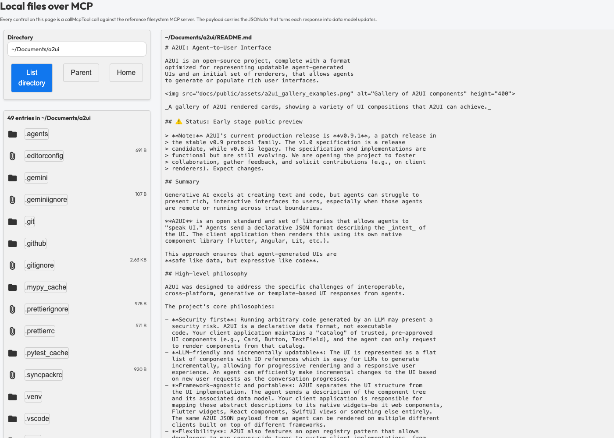

# A2UI over MCP Demo - Filesystem Browser

A file browser with no agent, no A2UI server, and no client code that knows
anything about files. The UI is a static A2UI JSON payload, the data comes from
the reference
[filesystem MCP server](https://github.com/modelcontextprotocol/servers/tree/main/src/filesystem),
and the `callMcpTool` catalog function is the only thing between them.



## What this sample shows

An A2UI mini-app can ship real functionality to a host that already speaks MCP.
This one demonstrates three things:

- **The payload drives the tools.** Every control in
  [fs_browser_a2ui.json](fs_browser_a2ui.json) is a `callMcpTool` function call.
  Clicking a row runs no application code.
- **A server that never heard of A2UI still renders.** The filesystem server
  answers in plain text. JSONata in the payload turns that text into
  `updateDataModel` messages, which `callMcpTool` applies to the surface.
- **The host is scaffolding only.** [client/app.ts](client/app.ts) connects one
  MCP client, hands the payload to the renderer, and runs the call the payload
  names as its first. It contains no filesystem logic and no UI.

## Run it

Run these commands from `samples/community`:

```bash
yarn install
yarn workspace a2ui-over-mcp-filesystem run dev
```

Open http://localhost:5174. The page opens on your home directory. Click a
directory row to list it, click a file row to read it, or run a `search_files`
glob below the current directory.

One command starts both halves of the demo:

- `mcp-proxy` runs `@modelcontextprotocol/server-filesystem` over `~` and
  relays it over Streamable HTTP on `127.0.0.1:8787`.
- Vite serves the page on port 5174 and proxies `/mcp` to the relay, so the
  page and the MCP server share one origin.

> [!WARNING]
> While the demo runs, `127.0.0.1:8787` serves every filesystem tool, including
> `write_file`, `edit_file`, and `move_file`, with
> `Access-Control-Allow-Origin: *`. Any page open in your browser can reach it.
> The filesystem server has no read-only mode: its `readOnlyHint` annotations
> are advisory, and its only real boundary is the directory on its command
> line. Stop the demo when you are done with it.

### Browse somewhere else

Set `A2UI_FS_ROOT` to the directory the server may read:

```bash
A2UI_FS_ROOT="$HOME/Documents" yarn workspace a2ui-over-mcp-filesystem run dev
```

The server refuses any path outside that root. It expands a leading `~`
itself, which is why the default needs no shell expansion.

## How it works

```text
browser                                  node
+-----------------------------+          +--------------------------------+
| a2ui_filesystem.json        |          | vite            (port 5174)    |
|   callMcpTool(...)          |  /mcp    |   proxy /mcp -> 127.0.0.1:8787 |
| @a2ui/mcp-catalog           | <------> | mcp-proxy       (port 8787)    |
|   dataModelUpdateJsonata    |          |   | stdio                      |
| client/app.ts (scaffolding) |          |   v                            |
+-----------------------------+          | server-filesystem (npx)        |
                                         +--------------------------------+
```

The payload declares the surface and binds every control to a tool call. A
directory listing lands at `/entries`, and the row template turns each entry
into a button whose tool name comes from the entry itself: a directory calls
`list_directory_with_sizes`, a file calls `read_text_file`.

The payload also declares its own first call, under `/startup`. The host loops
over that array, so even the opening screen is the payload's decision.

The proxy exists because the filesystem server speaks JSON-RPC over stdio,
which a page cannot open. `mcp-proxy` runs it as a child process and relays it
over Streamable HTTP. One child process serves every browser session.

## Arguments live in the data model

Tool arguments are ordinary data. The payload keeps a ready-made arguments
object for each control under `/args`, and each control binds to one:

```json
{
  "name": "search_files",
  "arguments": {"path": "/args/search"},
  "dataModelUpdateJsonata": {"path": "/jsonata/search"}
}
```

That keeps the arguments editable by the UI itself. The search field binds
straight to `/args/search/pattern`, so typing in it rewrites the argument the
button will send. Navigating rewrites `/args/search/path` and the two nav
button arguments, all from the same expression that fills `/entries`.

A list row carries its own arguments the same way, at `args` within the row,
which the row binds with the relative path `{"path": "args"}`.

## The JSONata

`dataModelUpdateJsonata` reads the MCP result and produces data model paths to
write. This sample keeps its three expressions in the data model under
`/jsonata`, so a control, or a row, can name one by path. The listing
expression reads:

```jsonata
(
  $dir := $args.path;
  $up := $substringBefore($dir, '/' & $split($dir, '/')[-1]);
  $rows := [
    $split($join(content[type = 'text'].text, '\n'), '\n')[$contains($, /^\[(DIR|FILE)\]/)].(
      $g := $match($, /^\[(DIR|FILE)\]\s+(.+?)(?:\s\s+([0-9.]+ [A-Za-z]+))?\s*$/).groups;
      $isDir := $g[0] = 'DIR';
      {
        'name': $g[1],
        'size': $g[2] ? $g[2] : '',
        'icon': $isDir ? 'folder' : 'attachFile',
        'tool': $isDir ? 'list_directory_with_sizes' : 'read_text_file',
        'args': { 'path': ($dir = '/' ? '' : $dir) & '/' & $g[1] },
        'jsonata': $isDir ? $root.jsonata.list : $root.jsonata.read
      }
    )
  ];
  {
    '/args/open/path': $dir,
    '/args/parent/path': $up = '' ? '/' : $up,
    '/args/search/path': $dir,
    '/entries': $rows,
    '/entries_title': $string($count($rows))
      & ($count($rows) = 1 ? ' entry in ' : ' entries in ') & $dir
  }
)
```

Each key of the result becomes one `updateDataModel` message against the
surface. `$args` holds the arguments the call ran with, and `$root` holds the
data model, which is how each row picks up the expression it will use next.
Parsing `[DIR] name  size` lines into row objects is the whole adapter, and it
ships with the UI rather than with the client.

## Files

| File                                           | Purpose                                                            |
| ---------------------------------------------- | ------------------------------------------------------------------ |
| [a2ui_filesystem.json](a2ui_filesystem.json)   | The A2UI payload: the UI, every tool call, and every JSONata.      |
| [client/app.ts](client/app.ts)                 | The host: connects to MCP, processes the payload, runs `/startup`. |
| [client/vite.config.ts](client/vite.config.ts) | Dev server, the `/mcp` proxy, and catalog resolution.              |
| [package.json](package.json)                   | `yarn dev`: the MCP relay and the web server, side by side.        |

## Test and build

Run these commands from `samples/community`:

```bash
yarn workspace a2ui-over-mcp-filesystem run test
yarn workspace a2ui-over-mcp-filesystem run build
```

The tests mock the MCP server with responses captured from a real one. They
cover the payload validating against the catalog it names, the startup call,
and each JSONata expression turning server text into the data model.
